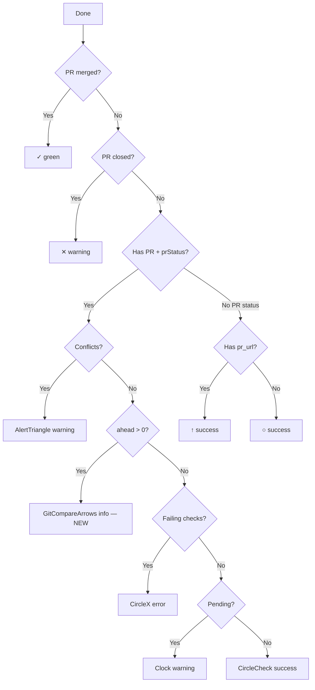

## Summary

Add a "needs push" status icon to `StatusSymbol` for done tasks where the local branch is ahead of remote. This new state sits between "conflicts" and "failing checks" in the done-state precedence, making it clear that the next action is to push — not fix CI.

## Scope

**In scope:**
- New "needs push" icon/color in `StatusSymbol` when `syncStatus.ahead > 0`
- Fetching per-task sync status via `PrStatusProvider` (co-located with existing PR polling)
- Threading sync status through FeedSection → FeedTaskRow → FeedRow → StatusSymbol
- Tests for new precedence behavior

**Out of scope:**
- Handling `behind > 0` or `diverged` as separate icon states (could be future work)
- Changes to `PrGitSection` or the PR tab

## Implementation Map

| File | Change |
|------|--------|
| `src/providers/PrStatusProvider.tsx` | Add `task_sync_status` fetch alongside PR status. Expose `getTaskSyncStatus(taskId): SyncStatus \| undefined` on context. Store in a parallel `Map<string, SyncStatus>`. |
| `src/components/Feed/FeedSection.tsx` | Destructure `getTaskSyncStatus` from `usePrStatus()`, pass to `FeedTaskRow` |
| `src/components/Feed/FeedTaskRow.tsx` | Accept `syncStatus?: SyncStatus` prop, forward to `FeedRow` |
| `src/components/Feed/FeedRow.tsx` | Accept `syncStatus?: SyncStatus` prop, forward to `StatusSymbol` |
| `src/components/Feed/StatusSymbol.tsx` | Accept `syncStatus?: SyncStatus` prop. Add new case in done-state block. Import `GitCompareArrows` from lucide-react. |
| `src/components/Feed/StatusSymbol.test.tsx` | Tests for new state and precedence |

**Updated done-state precedence in `StatusSymbol`:**

**Patterns to follow:**
- `PrStatusProvider.tsx:88-125` — `fetchPrStatus` pattern for per-task fetching. Mirror this for sync status using `task_sync_status` transport call with `{ task_id }`.
- `StatusSymbol.tsx:132-159` — existing done-state PR health switch. Insert the new `ahead > 0` check between the conflicts case and the `derivePrHealth` switch.
- `StatusSymbol.test.tsx:186-228` — precedence test pattern (render with both conditions, assert the higher-precedence icon wins).

**Key interfaces:**
- `SyncStatus` from `src/types/workflow.ts` (already defined: `{ ahead: number, behind: number, diverged: boolean }`)
- `PrStatusContextValue` in `PrStatusProvider.tsx` — extend with `getTaskSyncStatus`
- Transport call: `task_sync_status` with `{ task_id: string }` returning `SyncStatus | null`

**Reusable code:**
- `SyncStatus` type already exists at `src/types/workflow.ts:744`
- `task_sync_status` transport command already mapped in `TauriTransport.ts:89`
- `usePolling` hook already used by PrStatusProvider — no new polling infra needed

**Icon:** `GitCompareArrows` from lucide-react at 14px (matches `PR_ICON_SIZE`), with `text-status-info` / `bg-status-info-bg` colors (blue). Visually distinct from error (red/failing checks) and warning (yellow/conflicts), communicates "branches out of sync." Add `data-testid="icon-needs-push"` for testability.

## Success Criteria

1. Done task with `ahead > 0` shows the `GitCompareArrows` icon with info (blue) colors, regardless of check status
2. Conflicts still take precedence over needs-push (conflicts + ahead > 0 → shows conflict icon)
3. Needs-push takes precedence over failing checks (ahead > 0 + failing checks → shows push icon)
4. Done tasks with `ahead === 0` behave exactly as before (no regression)
5. Sync status is fetched on the same cadence as PR status polling (10s background, no extra polling loop)
6. `PrStatusProvider` only fetches sync status for tasks that have a `pr_url` and are not in terminal PR state

## Verification Strategy

**New tests in `StatusSymbol.test.tsx`:**
- "renders GitCompareArrows icon with info colors when done task is ahead of remote" — provide `syncStatus: { ahead: 2, behind: 0, diverged: false }` with passing checks
- "needs-push takes precedence over failing checks" — provide both `ahead > 0` and failing checks, assert GitCompareArrows icon wins
- "conflicts take precedence over needs-push" — provide conflicts + `ahead > 0`, assert AlertTriangle wins
- "in-sync task shows normal check status" — provide `ahead: 0` with failing checks, assert CircleX (regression guard)

**Existing test coverage:** The current `StatusSymbol.test.tsx` tests cover all other done sub-states and will serve as regression guards.

**PrStatusProvider tests:** Add a test in `PrStatusProvider.test.tsx` that verifies `getTaskSyncStatus` returns the fetched sync status for a done task with a PR.