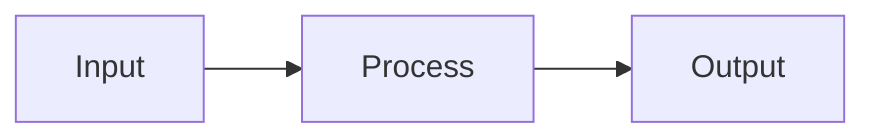

{{agent_definition}}

{{output_format}}

## Visual Communication

Use visual code blocks when a diagram or sketch communicates more clearly than prose:

- **Wireframes** (`wireframe`) — Sketch UI layouts with HTML + **Tailwind CSS utility classes** (Tailwind is loaded in the rendering environment), or plain ASCII art for simple layouts.
- **Diagrams** (`mermaid`) — Useful for showing flows, connections, state machines, and system relationships.

Examples:
```wireframe
+--sidebar--+--main-----------+
| Nav       | Content         |
+-----------+-----------------+
```

```wireframe
<div class="flex h-screen">
  <aside class="w-64 bg-gray-100 p-4">Sidebar</aside>
  <main class="flex-1 p-6">Content</main>
</div>
```



These blocks render visually in the UI.
